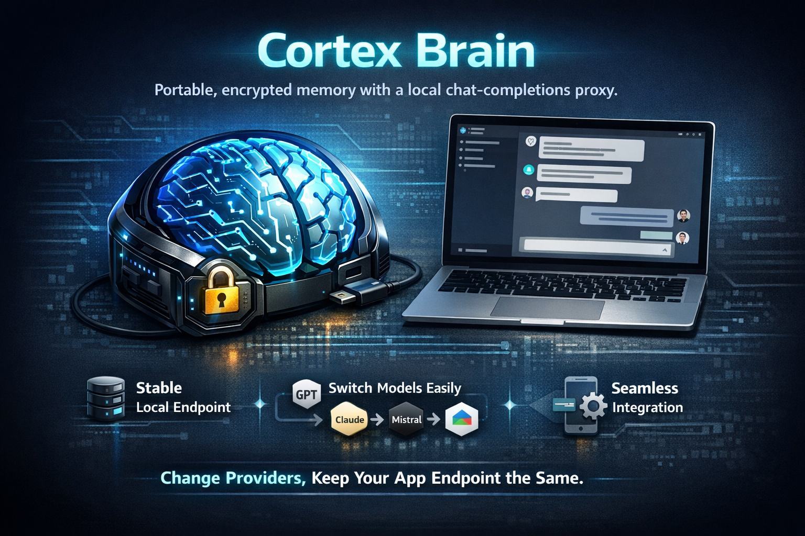

<div align="center">
  
  <h1>Cortex Portable Brain & Proxy</h1>
  <p><strong>A standalone Rust workspace for local encrypted brain management and OpenAI-compatible proxying.</strong></p>
  
  <p>
    <a href="https://github.com/vinzify/Cortex-v3.1-RMVM---Relational-Memory-Virtual-Machine/releases"></a>
    <a href="https://rust-lang.org/"></a>
    <a href="https://github.com/vinzify/Cortex-v3.1-RMVM---Relational-Memory-Virtual-Machine/blob/main/LICENSE"></a>
    <a href="https://github.com/vinzify/Cortex-v3.1-RMVM---Relational-Memory-Virtual-Machine/stargazers"></a>
  </p>
</div>

> [!WARNING]
> **Deprecated location:** The portable layer is being split into standalone `cortex-brain`. See the migration guide in `cortex-brain/docs/migration_from_cortex_rmvm.md`.

Portable Brain provides a high-level UI/UX layer on top of Cortex v3.1 RMVM. it allows you to manage local encrypted memory workspaces and interact with them using standard OpenAI-compatible tools. 🧠🛡️

> [!IMPORTANT]
> **Experimental:** This project is in an early experimental phase and requires refinements.


## ✨ Workspace Modules

*   **🗄️ `brain-store`**: Local encrypted brain workspaces. Supports create, list, export, import, branch, merge, and audit operations.
*   **🔌 `adapter-rmvm`**: gRPC adapter for seamless communication with the RMVM kernel.
*   **🛡️ `planner-guard`**: plan-only prompt builder and RMVM plan validation.
*   **💻 `cortex-app`**: The primary `cortex` CLI and OpenAI-compatible proxy endpoint.

## 🚀 Quick Start

### 1. 🛠️ Build and Test
```bash
cd portable-brain-proxy
# Run the local workspace tests
cargo test
```

### 2. 🧠 Create and Select a Brain
```bash
# Set your encryption secret
$env:CORTEX_BRAIN_SECRET="demo-secret" # Windows PowerShell

# Create a new brain workspace
cargo run -p cortex-app -- brain create demo
cargo run -p cortex-app -- brain use demo
```

### 3. 🌐 Start Proxy with OpenAI Compatibility
```bash
# Configure your planner
$env:CORTEX_PLANNER_MODE="openai"
$env:CORTEX_PLANNER_API_KEY="your-key-here"

# Start the proxy server
cargo run -p cortex-app -- proxy serve --addr 127.0.0.1:8080
```

## 🛠️ CLI Reference

The `cortex` CLI is the Swiss Army knife for your portable memory. 🔨🔧

| Command | Description |
| :--- | :--- |
| `brain create <name>` | Initialize a new encrypted memory workspace. |
| `brain list` | Show all local brains. |
| `brain branch <name>` | Create a new memory fork. |
| `proxy serve` | Start the OpenAI-compatible API server. |
| `auth map-key` | Map an API key to a specific brain/tenant. |

## ⚙️ Environment Configuration

| Variable | Description | Default |
| :--- | :--- | :--- |
| `CORTEX_BRAIN_SECRET` | **Required** passphrase for brain encryption. | - |
| `CORTEX_ENDPOINT` | RMVM gRPC endpoint address. | `127.0.0.1:50051` |
| `CORTEX_PLANNER_MODE` | Selection logic (`openai`, `byo`, `fallback`). | `openai` |

---
## 📜 License
**License:** MIT

---
💖 **Support the Project**

If you want to support its continued development, consider sending an ETH donation: 
`0xe7043f731a2f36679a676938e021c6B67F80b9A1`

---
*Portable Brain - Deterministic memory, everywhere.*
